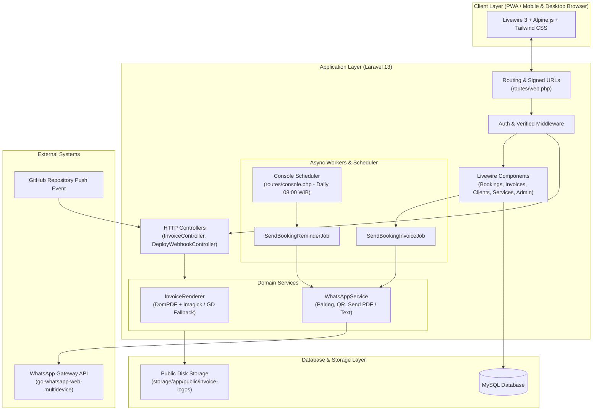
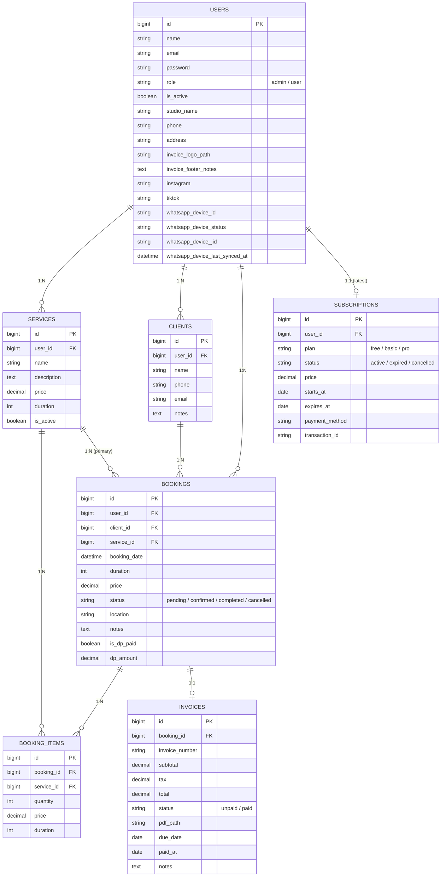

# MUA Manager — System & Architecture Mapping

Dokumen ini adalah **panduan arsitektur dan peta modul (system mapping)** resmi untuk project **MUA Manager**.  
**Wajib dibaca oleh developer atau AI Agent sebelum merancang, menambah, atau memodifikasi fitur** agar setiap perubahan terisolasi dengan baik, konsisten, dan tidak menimbulkan _regresi/side-effects_.

---

## 1. Ringkasan Eksekutif & Tech Stack

| Layer                   | Teknologi / Library                                      | Catatan                                                       |
| :---------------------- | :------------------------------------------------------- | :------------------------------------------------------------ |
| **Framework**           | Laravel 13 (PHP 8.3+)                                    | Routing, Eloquent ORM, Jobs/Queues, Console Scheduling        |
| **UI Reactive**         | Livewire 3 + Volt                                        | Class-based Livewire di `app/Livewire/`, Volt di Profile/Auth |
| **Styling**             | Tailwind CSS 3 + PostCSS                                 | Desain responsif (Mobile-first PWA ready)                     |
| **Frontend Utilities**  | Alpine.js                                                | Micro-interactions, modal dialogs, Alpine state bindings      |
| **Database**            | MySQL / MariaDB (Production), SQLite in-memory (Testing) | Multi-tenant by `user_id`                                     |
| **PDF Engine**          | `barryvdh/laravel-dompdf`                                | Template A4 di `resources/views/invoices/pdf.blade.php`       |
| **Image Render Engine** | Imagick / PHP GD Canvas (Fallback)                       | Renderer di `app/Services/InvoiceRenderer.php`                |
| **WhatsApp Gateway**    | `go-whatsapp-web-multidevice`                            | Integrasi HTTP API di `app/Services/WhatsAppService.php`      |
| **CI/CD Auto-Deploy**   | GitHub Webhook + Shell Script                            | Endpoint `/webhooks/github/deploy` & `deploy.sh`              |

---

## 2. Diagram Alur Sistem (System Flowchart)



---

## 3. Peta Modul Terinci (Detailed Module Mapping)

### A. Modul Booking (Core Business Logic)

- **Model**: `app/Models/Booking.php`, `app/Models/BookingItem.php`
- **Tabel**: `bookings` (termasuk kolom `transport_fee`, `dp_amount`, `is_dp_paid`), `booking_items`
- **Livewire Components**:
    - `app/Livewire/Bookings/BookingIndex.php` & `resources/views/livewire/bookings/booking-index.blade.php`: Tabel list booking, pencarian nama klien, filter status/tanggal, quick action (konfirmasi, selesai, kirim reminder WA instan, hapus).
    - `app/Livewire/Bookings/BookingCreate.php` & `resources/views/livewire/bookings/booking-create.blade.php`: Form booking multi-layanan, input biaya transport (`transport_fee`), deteksi bentrok jadwal otomatis, inline creation klien baru, kalkulasi DP & sisa tagihan, auto-generate invoice, auto-dispatch job WA.
    - `app/Livewire/Bookings/BookingEdit.php` & `resources/views/livewire/bookings/booking-edit.blade.php`: Edit multi-item layanan, input biaya transport, penyesuaian DP/harga total, collision check akurat, dan sinkronisasi otomatis ke `booking_items` & `invoices`.
    - `app/Livewire/Bookings/BookingCalendar.php` & `resources/views/livewire/bookings/booking-calendar.blade.php`: Grid visual kalender bulanan dengan badge status.
- **Blade View**: `resources/views/bookings/show.blade.php` (Detail booking, kartu Biaya Transport, rincian item layanan, status pembayaran, tombol Google Calendar, link chat WhatsApp klien, dan tombol invoice PDF).

### B. Modul Invoice & Render Engine

- **Model**: `app/Models/Invoice.php`
- **Tabel**: `invoices`
- **Controller**: `app/Http/Controllers/InvoiceController.php`
    - `pdf()`: Stream PDF invoice privat (auth only).
    - `previewJpg()`: Redirect ke signed temporary JPG route.
    - `publicPdf()`: Download PDF via valid URL signature.
    - `publicJpg()`: Tampilkan binary JPG invoice via valid signature.
- **Livewire**: `app/Livewire/Invoices/InvoiceIndex.php` & `resources/views/livewire/invoices/invoice-index.blade.php`:
    - Modal pelunasan interaktif dengan pilihan metode pembayaran (BCA, Mandiri, BRI, BNI, QRIS, Tunai).
    - Opsi kirim kuitansi pelunasan otomatis ke WhatsApp klien.
    - Filter periode (Bulan & Tahun) serta kartu KPI omset (Total Invoice, Lunas, Piutang).
    - Export data laporan keuangan ke file CSV (`exportCsv`).
    - Trigger kirim ulang invoice PDF via WA.
- **Template PDF**: `resources/views/invoices/pdf.blade.php`: Desain invoice A4 bertema rose-dusty (`#d99c9c`), memuat logo studio, sosmed MUA, rincian booking items, baris Subtotal Layanan & Biaya Transport terpisah, DP, sisa tagihan, dan instruksi transfer.
- **Service Renderer**: `app/Services/InvoiceRenderer.php`:
    - Mode 1: PDF to JPG via PHP Imagick extension.
    - Mode 2 (Fallback): Pure PHP GD image generation jika Imagick tidak tersedia (1240x1754 px canvas) dengan kalkulasi akurat (Subtotal + Transport - DP).

### C. Modul Integrasi WhatsApp Gateway

- **Service**: `app/Services/WhatsAppService.php`
    - Integrasi HTTP API ke server `go-whatsapp-web-multidevice`.
    - Manajemen device (`createDevice` otomatis membuat unique device ID per user `user-{id}-{hash}`, `refreshDeviceStatus`).
    - Autentikasi pairing (`requestLoginQr`, `requestPairingCode` otomatis auto-provision device jika belum ada).
    - Pengiriman invoice (`sendInvoiceCreated` -> endpoint `/send/file` multipart PDF beserta rincian transport fee).
    - Pengiriman pesan reminder (`sendReminder` -> endpoint `/send/message`).
    - Pengiriman kuitansi pelunasan (`sendPaymentReceipt` -> endpoint `/send/message`).
    - Test koneksi pesan (`sendTestMessage`).
- **Queue Jobs**:
    - `app/Jobs/SendBookingInvoiceJob.php`: Asynchronous sender invoice PDF.
    - `app/Jobs/SendBookingReminderJob.php`: Asynchronous sender reminder H-1.
- **Scheduler**: `routes/console.php`: Cron harian pukul 08:00 WIB untuk memeriksa booking berstatus `confirmed`/`pending` besok hari dan mengirim reminder WA.

### D. Modul Klien (Clients)

- **Model**: `app/Models/Client.php`
- **Tabel**: `clients`
- **Livewire**: `app/Livewire/Clients/ClientIndex.php` & `resources/views/livewire/clients/client-index.blade.php`
    - CRUD Klien via Livewire Modal.
    - Normalisasi otomatis nomor telepon ke format `628xxx`.
    - Pelacakan jumlah booking per klien (`withCount('bookings')`).

### E. Modul Layanan (Services)

- **Model**: `app/Models/Service.php`
- **Tabel**: `services`
- **Livewire**: `app/Livewire/Services/ServiceIndex.php` & `resources/views/livewire/services/service-index.blade.php`
    - CRUD katalog layanan (nama, deskripsi, harga, durasi dalam menit, status `is_active`).

### F. Modul Profil Studio & Panel Admin

- **Model**: `app/Models/User.php`
- **Tabel**: `users`
- **Volt Component**: `resources/views/livewire/profile/update-profile-information-form.blade.php`: Form data profil studio, upload logo invoice, catatan pembayaran/footer invoice, nomor WhatsApp, Instagram, TikTok, serta kontrol pairing gateway WA (QR / Code).
- **Admin Panel**: `app/Livewire/Admin/UserIndex.php` & `resources/views/livewire/admin/user-index.blade.php`: Pengelolaan seluruh akun MUA dan toggle aktif/nonaktif (`is_active`).

---

## 4. Skema Basis Data & Relasi (ERD)



---

## 5. Matriks Tindakan Cepat (Quick Action Matrix)

Gunakan panduan ini untuk menentukan file mana saja yang perlu diedit saat ada permintaan fitur baru:

| Permintaan / Modifikasi                                                                  | File yang Wajib Diperiksa & Dimodifikasi                                                                                                                                                                                                                                                                                                                                                                                                               |
| :--------------------------------------------------------------------------------------- | :----------------------------------------------------------------------------------------------------------------------------------------------------------------------------------------------------------------------------------------------------------------------------------------------------------------------------------------------------------------------------------------------------------------------------------------------------- |
| **Menambah Field di Booking** _(misal: Diskon, Tipe Acara, Lokasi Google Maps, Asisten)_ | 1. `database/migrations/xxxx_add_..._to_bookings_table.php`<br>2. `app/Models/Booking.php` (`$fillable`, `$casts`)<br>3. `app/Livewire/Bookings/BookingCreate.php` & `BookingEdit.php`<br>4. `resources/views/livewire/bookings/booking-create.blade.php` & `booking-edit.blade.php`<br>5. `resources/views/bookings/show.blade.php`<br>6. `resources/views/invoices/pdf.blade.php` & `app/Services/InvoiceRenderer.php` _(jika mempengaruhi invoice)_ |
| **Mengubah Format / Tampilan Invoice PDF / Gambar**                                      | 1. `resources/views/invoices/pdf.blade.php` (Styling & layout utama)<br>2. `app/Services/InvoiceRenderer.php` (Method `renderWithGd` untuk fallback canvas)<br>3. `app/Http/Controllers/InvoiceController.php`                                                                                                                                                                                                                                         |
| **Mengubah Format Pesan WhatsApp / Pengingat**                                           | 1. `app/Services/WhatsAppService.php` (`buildInvoiceCaption` & `buildReminderMessage`)<br>2. `routes/console.php` _(jika mengubah jadwal cron)_                                                                                                                                                                                                                                                                                                        |
| **Menambah Pengaturan Profil / Akun MUA**                                                | 1. `database/migrations/` (jika menambah kolom `users`)<br>2. `app/Models/User.php`<br>3. `resources/views/livewire/profile/update-profile-information-form.blade.php`                                                                                                                                                                                                                                                                                 |
| **Menambah Fitur Layanan / Kategori Paket**                                              | 1. `app/Models/Service.php`<br>2. `app/Livewire/Services/ServiceIndex.php`<br>3. `resources/views/livewire/services/service-index.blade.php`                                                                                                                                                                                                                                                                                                           |
| **Menambah Fitur Pembayaran Online / Langganan (SaaS Midtrans/Xendit)**                  | 1. `app/Models/Subscription.php`<br>2. Migration `subscriptions` / Payment logs<br>3. Controller Webhook Payment Gateway<br>4. Middleware pengecekan masa aktif langganan                                                                                                                                                                                                                                                                              |

---

## 6. Aturan & Konvensi Penting (Key Invariants & Coding Rules)

1. **Prinsip Multi-Tenancy & Autentikasi**:
    - Seluruh data booking, klien, invoice, dan layanan harus selalu difilter berdasarkan `user_id = auth()->id()`.
    - Lakukan otorisasi kepemilikan eksplisit:
        ```php
        abort_unless($booking->user_id === auth()->id() || auth()->user()->isAdmin(), 403);
        ```
2. **Normalisasi Nomor Telepon WhatsApp**:
    - Nomor telepon wajib dinormalisasi ke format `628xxx` tanpa karakter non-digit dan tanpa awalan `0` atau `+`.
3. **Pemisahan Async Job**:
    - Komunikasi I/O ke WhatsApp Gateway **tidak boleh** dijalankan langsung di request Livewire/Controller agar tidak memblokir user UI. Selalu lewatkan melalui Queue (`SendBookingInvoiceJob`).
4. **Sinkronisasi Dua Engine Render Invoice**:
    - Jika mengubah tata letak atau data yang tampil di `resources/views/invoices/pdf.blade.php`, perbarui juga fungsi `renderWithGd()` di `InvoiceRenderer.php` agar rendering fallback tidak tertinggal.
5. **Testing Suite**:
    - Selalu validasi perubahan dengan test suite di `tests/Feature/Livewire/` (seperti `BookingTest.php`, `InvoiceTest.php`, `ClientTest.php`, dll).
